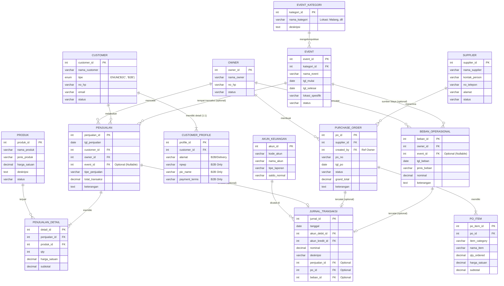

# ERD COOKIE CLUB (REVISI MASA DEPAN v2.0)
## Visualisasi & Dokumentasi Teknis Lengkap

---

### 📋 CATATAN PENTING (REVISI BERDASARKAN FEEDBACK DOSEN)

1.  **CUSTOMER & PROFILE**:
    *   Tabel `CUSTOMER_B2C_PROFILE` dan `CUSTOMER_B2B_PROFILE` **DIHAPUS**.
    *   Digantikan oleh **SATU** tabel `CUSTOMER_PROFILE` yang berisi gabungan atribut 
    *   Tabel `CUSTOMER` menggunakan `ENUM('B2C', 'B2B')` untuk tipe customer.

2.  **EVENT MANAGEMENT**:
    *   Tabel `CUSTOMER_EVENT_PROFILE` **DIHAPUS** (karena event bukan "customer" tapi "aktivitas").
    *   Dibuat tabel **`EVENT`** sebagai master data untuk event-event konsisten/besar.
    *   Dibuat tabel **`EVENT_KATEGORI`** untuk hierarki lokasi (Malang, Balikpapan, dll) sesuai visi masa depan.
    *   Penjualan di event dicatat di tabel `PENJUALAN` dengan FK optional ke tabel `EVENT`.

3.  **PURCHASING**:
    *   Tetap menggunakan struktur unified (`SUPPLIER` + `PURCHASE_ORDER` + `PO_ITEM`) karena ini best practice untuk masa depan.

---

### 📊 VISUALISASI ERD (MERMAID DIAGRAM)



---

### 🏗️ STRUKTUR SQL LENGKAP (SCHEMA)

#### 1. CUSTOMER MANAGEMENT (REVISI)

**Tabel: CUSTOMER**
*Penyederhanaan tipe customer menggunakan ENUM sesuai saran dosen.*
```sql
CREATE TABLE CUSTOMER (
    customer_id INT PRIMARY KEY AUTO_INCREMENT,
    nama_customer VARCHAR(100) NOT NULL,
    tipe ENUM('B2C', 'B2B') NOT NULL,  -- REVISI: Pakai ENUM
    no_hp VARCHAR(15),
    email VARCHAR(100),
    status VARCHAR(20) DEFAULT 'Aktif',
    created_at TIMESTAMP DEFAULT CURRENT_TIMESTAMP
);
```

**Tabel: CUSTOMER_PROFILE**
*Satu tabel gabungan untuk detail B2B dan B2C. Kolom bersifat NULLABLE.*
```sql
CREATE TABLE CUSTOMER_PROFILE (
    profile_id INT PRIMARY KEY AUTO_INCREMENT,
    customer_id INT NOT NULL UNIQUE,
    
    -- Atribut B2B (Nullable)
    alamat_bisnis VARCHAR(255) NULL,
    npwp VARCHAR(20) NULL,
    pic_name VARCHAR(100) NULL,
    payment_terms VARCHAR(50) NULL,    
    
    FOREIGN KEY (customer_id) REFERENCES CUSTOMER(customer_id) ON DELETE CASCADE
);
```

#### 2. EVENT MANAGEMENT (REVISI HIERARKI)

**Tabel: EVENT_KATEGORI**
*Master data lokasi/wilayah untuk masa depan (Multi-kota).*
```sql
CREATE TABLE EVENT_KATEGORI (
    kategori_id INT PRIMARY KEY AUTO_INCREMENT,
    nama_kategori VARCHAR(100) NOT NULL,  -- Contoh: "Malang", "Surabaya"
    deskripsi TEXT
);
```

**Tabel: EVENT**
*Master data event yang konsisten/besar.*
```sql
CREATE TABLE EVENT (
    event_id INT PRIMARY KEY AUTO_INCREMENT,
    kategori_id INT NOT NULL,             -- FK ke Lokasi
    nama_event VARCHAR(100) NOT NULL,     -- Contoh: "FIB 2025"
    tgl_mulai DATE NOT NULL,
    tgl_selesai DATE,
    lokasi_spesifik VARCHAR(255),         -- Contoh: "Booth A5, Universitas Brawijaya"
    status VARCHAR(20) DEFAULT 'Aktif',   -- Planned/Active/Completed
    
    FOREIGN KEY (kategori_id) REFERENCES EVENT_KATEGORI(kategori_id)
);
```

#### 3. TRANSAKSI & OPERASIONAL (UPDATE)

**Tabel: PENJUALAN (Update)**
*Menambahkan kolom `event_id` (nullable) untuk relasi ke event tertentu.*
```sql
CREATE TABLE PENJUALAN (
    penjualan_id INT PRIMARY KEY AUTO_INCREMENT,
    tgl_penjualan DATE NOT NULL,
    customer_id INT NOT NULL,
    owner_id INT NOT NULL,
    event_id INT NULL,                    -- REVISI: FK ke tabel EVENT (Optional)
    tipe_penjualan VARCHAR(20) NOT NULL,  -- 'B2C', 'B2B', 'Event'
    total_transaksi DECIMAL(12,2) NOT NULL,
    keterangan TEXT,
    
    FOREIGN KEY (customer_id) REFERENCES CUSTOMER(customer_id),
    FOREIGN KEY (owner_id) REFERENCES OWNER(owner_id),
    FOREIGN KEY (event_id) REFERENCES EVENT(event_id)
);
```

**Tabel: BEBAN_OPERASIONAL (Update)**
*Menambahkan kolom `event_id` untuk tracking biaya spesifik event (sewa booth, dll).*
```sql
CREATE TABLE BEBAN_OPERASIONAL (
    beban_id INT PRIMARY KEY AUTO_INCREMENT,
    tgl_beban DATE NOT NULL,
    jenis_beban VARCHAR(50) NOT NULL,
    deskripsi VARCHAR(255) NOT NULL,
    nominal DECIMAL(12,2) NOT NULL,
    owner_id INT NOT NULL,
    event_id INT NULL,                    -- REVISI: FK ke tabel EVENT (Optional)
    
    FOREIGN KEY (owner_id) REFERENCES OWNER(owner_id),
    FOREIGN KEY (event_id) REFERENCES EVENT(event_id)
);
```

*(Tabel lainnya seperti OWNER, PRODUK, SUPPLIER, PURCHASE_ORDER, PO_ITEM, AKUN_KEUANGAN, JURNAL_TRANSAKSI tetap menggunakan struktur standar masa depan yang sudah disepakati sebelumnya)*.

---

### 🎯 ANALISIS KECOCOKAN DENGAN MASA DEPAN

1.  **Fleksibilitas Customer**: Struktur `CUSTOMER` + `CUSTOMER_PROFILE` sangat efisien. Jika ada customer B2B, kita isi field B2B. Jika B2C. Tidak perlu banyak join tabel, tapi data tetap terpisah rapi.
2.  **Skalabilitas Event**: Dengan memisahkan `EVENT` dan `EVENT_KATEGORI`, sistem siap jika Cookie Club buka cabang di kota lain. Kita bisa filter laporan: "Berapa total penjualan event di Malang vs Surabaya?".
3.  **ROI Tracking**: Karena `PENJUALAN` dan `BEBAN_OPERASIONAL` sama-sama punya FK ke `EVENT`, kita bisa hitung ROI per event dengan mudah: `(SUM(Penjualan) - SUM(Beban)) WHERE event_id = X`.
4.  **Purchasing Power**: Struktur purchasing unified siap menangani supplier bahan baku, kemasan, bahkan alat berat sekalipun tanpa perlu mengubah struktur database.
